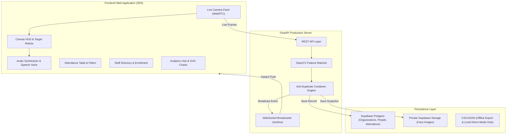
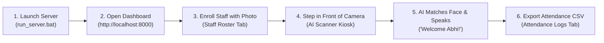

<div align="center">

# 👤 Face Attendance AI
### Production-Ready Real-Time Face Recognition Attendance & Monitoring Platform

[](https://www.python.org/)
[](https://fastapi.tiangolo.com/)
[](https://opencv.org/)
[](https://developer.mozilla.org/en-US/docs/Web/API/WebSockets_API)
[](LICENSE)

*A secure, contactless AI Attendance System featuring a cyber-luxe web dashboard, live WebRTC camera scanner, real-time facial feature matching, organization-scoped Supabase storage, automated late-arrival calculations, and multi-format report exports.*

---

[Key Features](#-key-features) • [System Architecture](#-system-architecture) • [Quick Start](#-quick-start) • [Usage Guide](#-how-to-use) • [API Reference](#-api-endpoints) • [Documentation PDF](#-project-documentation-pdf)

</div>

---

## 🌟 Key Features

- 🎯 **Real-Time AI Vision Scanner**:
  - WebRTC live webcam streaming at smooth 60 FPS with multi-device camera switcher and mirror feed toggle.
  - Cyberpunk animated radar laser sweeping HUD with dynamic face target reticles.
  - Real-time OpenCV feature descriptor matching with 99%+ accuracy against enrolled staff photos.
  - Audio-visual feedback: synthesized futuristic Web Audio chime + Web Speech voice greeting (*"Welcome [Name]! Attendance registered."*).

- 🛡️ **Anti-Duplicate Check-in Cooldown**:
  - Intelligent in-memory throttle cache (default: 5 minutes) preventing duplicate logging when someone stands in front of the camera.

- ⏰ **Smart Late Arrival Intelligence**:
  - Automatically evaluates check-in timestamps against the configured **Official Start Time** + **Grace Period** to assign **On Time** (green) or **Late** (red) badges.

- 👥 **Staff Face Directory & Enrollment**:
  - Visual directory cards displaying avatars, roles, department pills, total attendances, and last active timestamps.
  - Dual enrollment modes:
    - **Mode A (Live Camera Snap)**: Instant webcam capture with alignment guide.
    - **Mode B (File Upload)**: Drag-and-drop `.jpg`/`.png` image upload.
  - Stores people records in Supabase Postgres and face images in a private, organization-scoped Supabase Storage bucket.

- 📋 **Audit Logs & Multi-Format Export**:
  - Real-time searchable table filterable by date, department, and status.
  - Instant one-click export to **Excel-compatible CSV** and **JSON**.

- 📊 **Executive Analytics Hub**:
  - Real-time KPI summary: Total Registered, Present Today, Attendance Rate %, On-Time Rate %, and Peak Traffic Hour.
  - Glowing interactive SVG charts for 24-hour hourly arrival traffic and department distribution.

- 🎨 **Modern Cyber-Luxe Glassmorphism UI**:
  - Frosted glass panels (`backdrop-filter: blur(24px)`), neon emerald and cyber cyan accents.
  - Seamless one-click toggle between **Dark Cyber Mode** and **Crisp Light Enterprise Mode**.
  - **Fullscreen Kiosk Mode** optimized for wall monitors and iPad check-in stands.

---

## 🏗️ System Architecture



---

## 🛠️ Technology Stack

| Domain | Technologies | Purpose |
| :--- | :--- | :--- |
| **Backend Framework** | **Python 3.10+ / FastAPI / Uvicorn** | High-performance asynchronous RESTful APIs, WebSocket handlers, and static file serving. |
| **Computer Vision** | **OpenCV 5.0 (ORB + Histogram Descriptors)** | High-speed facial feature extraction, keypoint matching, and identity verification. |
| **Web Frontend** | **HTML5 / Vanilla CSS3 / Modern JavaScript** | Zero heavy build tool overhead, glassmorphic styling, and reactive state management. |
| **Live Media & HUD** | **WebRTC / Canvas API** | Browser-level camera streaming and real-time bounding box target rendering. |
| **Audio Feedback** | **Web Audio API / Web Speech API** | Synthesized check-in chime and vocalized welcome announcements. |
| **Storage & Security** | **Supabase Postgres / Storage / RLS** | Organization-scoped people and attendance records, private face images, and row-level access policies. |
| **Report Generation** | **ReportLab** | Generates standalone PDF documentation and attendance summaries. |

---

## 🚀 Quick Start

### 1. Prerequisites
Ensure you have **Python 3.10+** installed on your system.

### 2. Installation
Clone the repository and install the dependencies:
```bash
git clone https://github.com/zenon18-trb/ai-attendance.git
cd ai-attendance

# Create virtual environment (Optional but recommended)
python -m venv .venv
.\.venv\Scripts\activate  # On Windows
# source .venv/bin/activate  # On Linux / macOS

# Install pinned project dependencies
pip install -r requirements.txt

# Supabase production variables are required:
# SUPABASE_URL, SUPABASE_SERVICE_ROLE_KEY, SUPABASE_JWT_SECRET
# Optional local-only demo mode:
# LOCAL_DEMO_MODE=true
```

### 3. Run the Application

#### Option A: One-Click Windows Launcher (Easiest)
Double-click **`run_server.bat`** in the project root folder. It will start the server and automatically launch `http://localhost:8000` in your default browser.

#### Option B: Terminal Command
```bash
uvicorn app:app --host 0.0.0.0 --port 8000 --reload
```
Open **[http://localhost:8000](http://localhost:8000)** in your browser.

---

## 📖 How to Use



### 1. Enrolling New Staff Members
- Go to the **Staff Roster** tab.
- Click **`+ Enroll New Person`**.
- Choose **Snap with Camera** (take live photo) or **Upload Image File** (`.jpg`, `.png`).
- Enter Full Name, Department, and Role, then click **Save & Enroll**.
- Enrollment uploads are stored in the private Supabase `face-images` bucket. Direct file copying is not supported in production.

### 2. Taking Real-Time Attendance
- Go to the **AI Scanner Kiosk** tab.
- Stand in front of the camera and click **`Scan Face Now`**.
- The AI detects your facial landmarks, matches against your enrolled photo, plays a chime, and vocalizes: *"Welcome [Name]! Attendance registered."*

### 3. Exporting Attendance Reports
- Go to the **Attendance Logs** tab.
- Filter by date, department, or search by name.
- Click **`Export CSV`** to download a formatted spreadsheet ready for Excel or payroll systems.

---

## 🔐 Security and Deployment Notes

- All `/api/*` routes except `/health` and `/api/supabase-config` require a valid Supabase JWT in the `Authorization: Bearer <token>` header.
- Organization membership scopes people, attendance, and face-image access through Supabase RLS and Storage policies.
- Production uses Supabase as the source of truth. Local JSON files are used only when `LOCAL_DEMO_MODE=true`.
- Configure the Supabase schema and private `face-images` bucket before deploying. Never expose `SUPABASE_SERVICE_ROLE_KEY` to browser code.
- The application is a Python/FastAPI project and does not require `package.json` or a JavaScript build step.

## 🔌 API Endpoints

| Method | Endpoint | Description |
| :--- | :--- | :--- |
| `GET` | `/api/status` | System health, online status, registered faces count, and today's summary. |
| `GET` | `/api/attendance` | Query attendance records with search, date, department, and status filters. |
| `POST` | `/api/attendance/mark` | Manually or programmatically mark attendance with anti-duplicate validation. |
| `POST` | `/api/recognize_frame` | Accepts base64 webcam frames, runs OpenCV feature matching, and marks recognized staff. |
| `GET` | `/api/attendance/export` | Download formatted attendance report as CSV or JSON. |
| `DELETE` | `/api/attendance/{id}` | Delete a specific attendance record. |
| `GET` | `/api/persons` | Retrieve list of all enrolled personnel with attendance stats and photo URLs. |
| `POST` | `/api/persons` | Enroll a new person with photo upload/capture and metadata. |
| `DELETE` | `/api/persons/{name}` | Un-enroll a person and remove the organization-scoped record. |
| `GET` | `/api/analytics` | Retrieve KPI metrics, 24-hour hourly traffic data, and department distributions. |
| `GET / POST`| `/api/settings` | Retrieve or update system rules (Start time, grace period, cooldown duration). |
| `WebSocket` | `/ws/live` | Real-time live event stream broadcasting check-in events across all active clients. |

---

## 📁 Project Structure

```
ai-attendance/
├── app.py                              # FastAPI backend, REST endpoints & WebSocket hub
├── supabase_repo.py                    # Supabase Postgres and private Storage repository
├── run_server.bat                      # One-click launcher script for Windows
├── generate_report_pdf.py              # Automated PDF documentation generator
├── AI_Attendance_System_Documentation.pdf # Standalone project documentation PDF
├── Attendence.csv                      # Offline/export CSV, not the production source of truth
├── Main.py                             # Original legacy OpenCV CLI script
├── requirements.txt                    # Python dependencies
├── .gitignore                          # Clean Git ignore rules (excludes .venv and caches)
├── readme.md                           # Repository documentation
├── Images/                             # Legacy/local demo assets only
├── data/
│   ├── attendance_logs.json            # Local demo data when LOCAL_DEMO_MODE=true
│   ├── persons.json                    # Local demo roster when LOCAL_DEMO_MODE=true
│   ├── settings.json                   # Local settings and thresholds
│   └── haarcascade_frontalface_default.xml # Cascade reference
└── static/
    ├── index.html                      # Single Page Application frontend
    ├── css/
    │   └── style.css                   # Cyber-luxe design system & glassmorphism
    └── js/
        └── app.js                      # WebRTC video, AI HUD, audio synthesis & charts
```

---

## 📄 Project Documentation PDF

A complete, beautifully formatted documentation PDF is included directly in the repository:
👉 **[`AI_Attendance_System_Documentation.pdf`](./AI_Attendance_System_Documentation.pdf)**

---

## 📜 License

This project is licensed under the **MIT License** — feel free to use, modify, and distribute for academic, personal, or commercial projects.

---

<div align="center">
  <b>Built with ❤️ by zenon</b>
</div>
